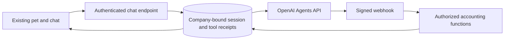

# ContaBot managed-agent pilot

ContaBot can run a user-started accounting task in an OpenAI-managed session and
continue after the browser closes. The existing pet, chat history, cards and
confirmation endpoint remain the interface. OpenAI owns model orchestration and
context compaction; ContabilidadOS owns company access, accounting services,
durable tool receipts, costs and the business record.

This is the first runtime/capability integration. It does not yet schedule a
company's monthly-close objectives, update a legal corpus, establish NIF coverage,
authorize automatic posting, file returns, or repair production code. Those are
separate workflows to add through the capability catalogue.

## Current capabilities

- Read invoices, bank movements, declarations, obligations and close/checklist state.
- Investigate reconciliation candidates and suggest account classifications.
- Retrieve fiscal articles, official values and jurisprudence through the existing KB.
- Read/write company facts, notes and pending evidence requests using existing services.
- Propose reconciliation and categorization through the existing confirmation card.
- Explain findings with the existing presentation cards.

Writers can save memory and proposals. Viewers get reads and presentation only.
The server rechecks membership and accounting-module access for every call.
Platform-operator status does not grant company access to this agent. The model
cannot select company/user IDs, use the operator MCP, access credentials, submit
returns, make payments, timbrar, or modify application code.

`consultar_capacidades` tells the model what is callable. A callable function is
not proof that data exists or that a fiscal regime is supported. Domain services
continue to return missing inputs and `NOT_SUPPORTED` where appropriate. Existing
heuristic reconciliation scores are not calibrated probabilities.

## Execution and recovery

`POST /api/ai/chat` returns a managed-run reference for opted-in companies.
`GET /api/ai/contabot/[id]` supplies progress to the same chat component. Other
companies retain the current runtime. Each user's conversation gets a persistent
provider session; a unique database reservation permits one active request per
company and conversation. Follow-up input has a durable idempotency key.

Webhooks and the existing in-app scheduler call the same synchronization code.
The recovery cron runs once a minute when that scheduler and `CRON_SECRET` are
configured. It only resumes previously requested work. It does not invent new
accounting objectives or send periodic prompts.

Tool results are keyed by local session, provider turn and call ID. Retries resend
the saved result. If a worker died after starting a write but before recording
its result, the task stops for inspection. It does not re-execute the write.
An ambiguous session-creation response is recovered by provider metadata; it
does not trigger another create request.

Completion requires a terminal provider turn. `idle`, HTTP 202 and a closed
browser are not success evidence. The final response and cards are saved in the
existing `ChatMessage`; reopening a conversation resumes observation of pending
work. Deleting a conversation first deletes its provider sessions. A failed remote
deletion remains retryable instead of orphaning provider history.

## Activation

1. Apply migration `20261010_contabot_managed_agent` and generate Prisma Client.
2. Supply `OPENAI_API_KEY` with `api.agents.read`, `api.agents.write`, and
   `api.responses.write` permissions in the deployment's secret store.
3. Register `https://<app-host>/api/webhooks/contabot` in the OpenAI project for
   `agent.session.created`, `agent.session.action_required`,
   `agent.session.in_progress`, `agent.session.idle`, and `agent.session.failed`.
   Store its signing secret as `CONTABOT_OPENAI_WEBHOOK_SECRET`.
4. Verify the in-app scheduler and `CRON_SECRET` are configured. Keep the recovery
   cron available during rollback so it can cancel/reconcile outstanding work.
5. Set `CONTABOT_MANAGED_COMPANY_IDS` to an explicit comma-separated pilot list,
   then set `CONTABOT_MANAGED_ENABLED=1`. There is no wildcard.
6. Start with a synthetic persona moral company and ask for a reconciliation
   investigation. Verify saved notes, proposed corrections, permission downgrade,
   browser-close recovery, history deletion and attributed usage before real data.

Sessions use `gpt-6-astra`, standard processing, `environment: none`, and no
subagents, shell, browser or MCP credentials. This uses API billing separately
from a ChatGPT subscription. Current Agents API documentation lists US residency
and no Zero Data Retention support; review that deployment constraint before
sending customer accounting data.

The existing company/user AI limits are checked before starting and before tool
callbacks. Each request is limited to 20 tool calls and ten minutes of observed
runtime. The minute recovery interval means cancellation is not instantaneous.
Provider usage is best-effort, not a final bill. For this pilot, `CostEvent`
records a conservative Astra estimate using long-context input/cache-write and
output rates; this can substantially overestimate actual charges. Unknown
terminal usage keeps the company reservation until it becomes available. These
checks are application backstops, not a provider-enforced hard per-turn spend cap.
Monitor actual provider billing during the pilot; this adapter does not establish
a strict provider spending ceiling.

Rollback: set `CONTABOT_MANAGED_ENABLED=0`; recovery cancels active work on its
next pass. Keep API/webhook credentials until pending sessions have been
reconciled/deleted. Company history remains readable by authorized members.

## Verification and limits

The contract/unit suite covers tool argument validation, viewer restrictions,
SDK request headers, final-output selection, unknown usage and real webhook
signature verification. The Postgres integration suite exercises session locking,
company isolation, permission changes, durable memory, duplicate callbacks,
ambiguous creation, terminal outcomes, budget reservations and provider deletion
with a synthetic provider transport.

These checks do not establish live API entitlement, deployed webhook delivery,
professional accounting correctness, corpus completeness or unattended monthly
close readiness. The live provider smoke test needs the configured project key
and webhook endpoint.

## Provider references (checked 2026-09-30)

- [Agents API quickstart](https://developers.openai.com/api/docs/guides/agents-api/quickstart)
- [Function tools and recovery](https://developers.openai.com/api/docs/guides/agents-api/tools/functions)
- [Sessions and events](https://developers.openai.com/api/docs/guides/agents-api/sessions/events)
- [Signed session webhooks](https://developers.openai.com/api/docs/guides/agents-api/sessions/webhooks)
- [Usage limitations](https://developers.openai.com/api/docs/guides/agents-api/observability)
- [Agents API deployment constraints](https://developers.openai.com/api/docs/guides/agents-api/overview)
- [Astra pricing](https://developers.openai.com/api/docs/models/gpt-6-astra)
