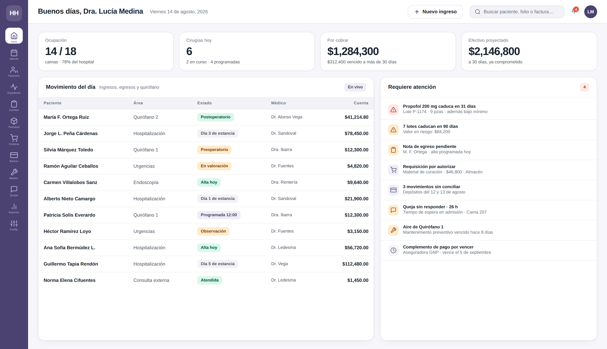
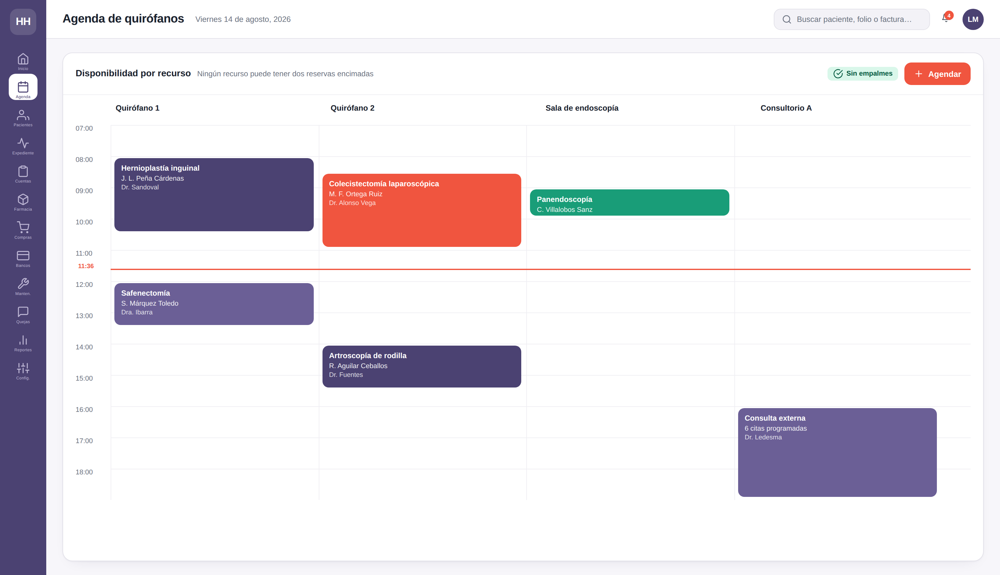
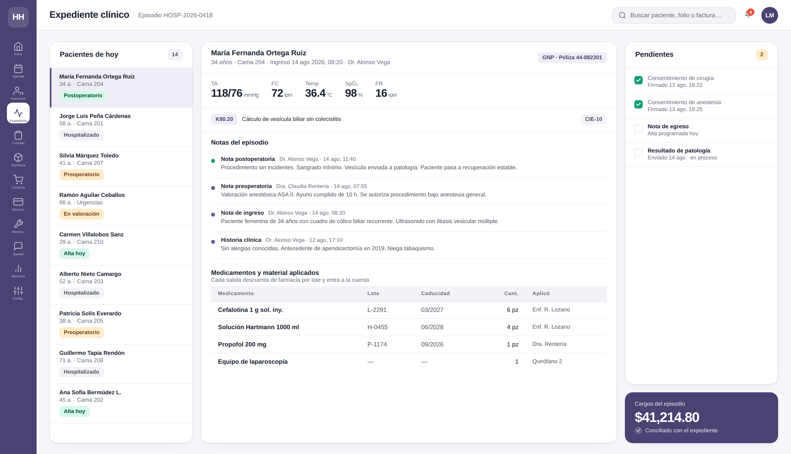
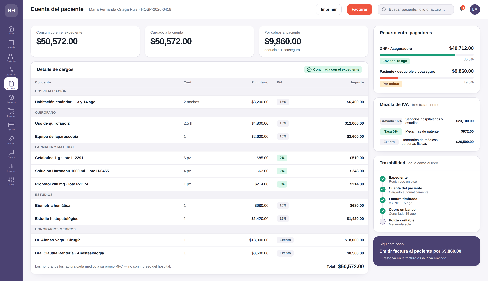
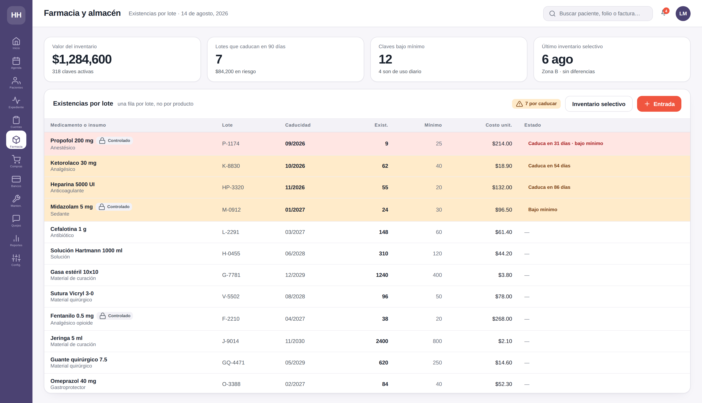
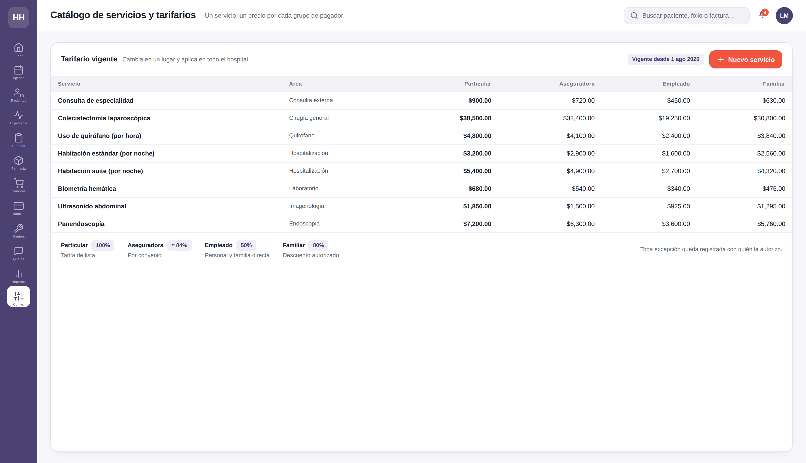
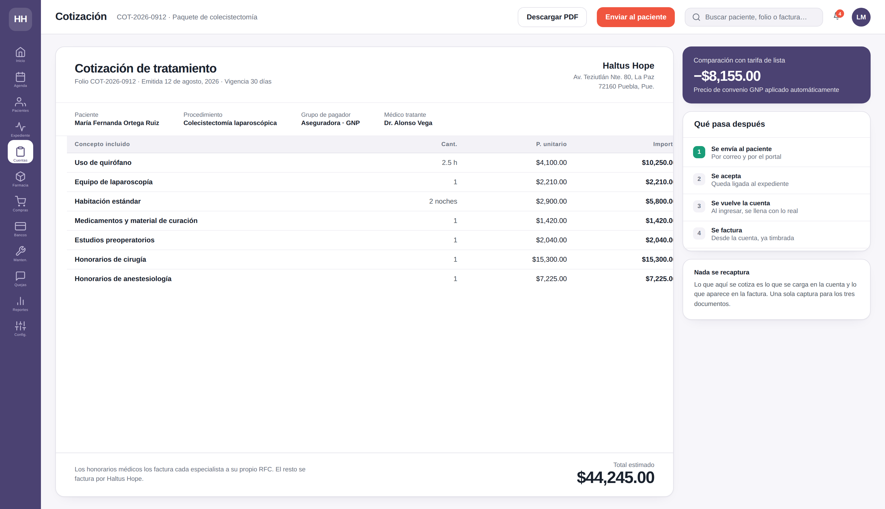
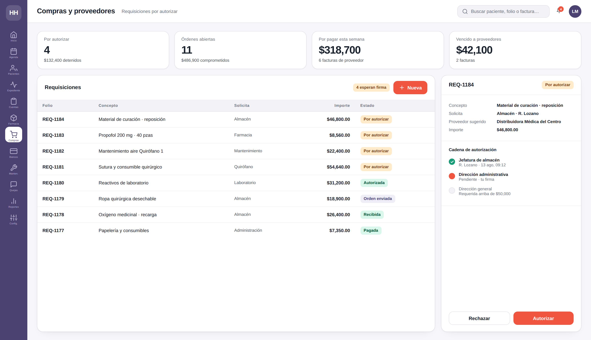
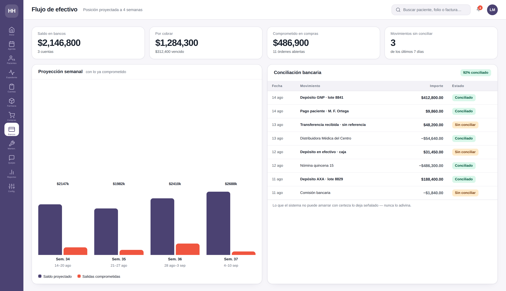
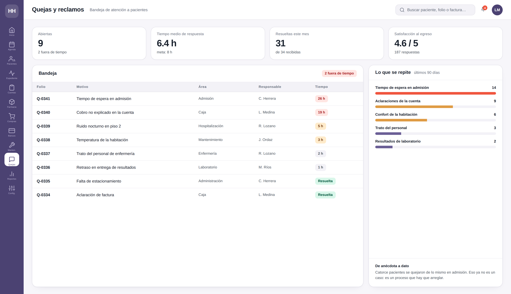

# Haltus Hope — Un solo sistema para operar el hospital

Propuesta de sistema integral para **Haltus Hope**, hospital privado en Puebla.
Presentación dirigida a dirección general y administrativa.

**[⬇ Descargar el deck (PowerPoint, 20 láminas)](haltus-hope.pptx)**  ·  [Brief de diseño de las pantallas](brief-mockups-haltus-hope.md)

> Esta página muestra las doce pantallas del sistema sin necesidad de descargar nada.
> El `.pptx` es para presentar en sala; aquí se revisa desde el navegador o el celular.

---

## La idea

Hoy la operación vive partida entre varios sistemas que no se hablan entre sí. La
información existe, pero nadie la ve completa, y hay personal calificado capturando
lo mismo dos y tres veces para que los números de un lado cuadren con los del otro.

La propuesta es **una sola cadena, sin huecos**:

```
expediente  →  cuenta del paciente  →  factura  →  banco  →  contabilidad
```

Cada eslabón se concilia contra el siguiente. Si se registró en el expediente, está
en la cuenta. Si está en la cuenta, ocurrió en el expediente.

---

## Un caso recorre las doce pantallas

Todo lo que se ve abajo es **el mismo paciente**: una colecistectomía laparoscópica
del 14 de agosto, Quirófano 2, con aseguradora y deducible.

Vale la pena ir y venir entre las pantallas: los medicamentos que el expediente
registra con su lote (`L-2291`, `P-1174`) son los mismos que descuentan de farmacia
y los mismos que aparecen cobrados en la cuenta, y las cifras cuadran entre las tres.
Esa continuidad *es* el argumento — la cadena sin huecos, demostrada en vez de
prometida.

---

## Las pantallas

### 1 · Tablero de dirección
**Resuelve:** enterarse de lo que pasa sin pedirle un reporte a nadie.

Ocupación, cirugías del día, cobranza y efectivo proyectado. A la derecha, lo que
requiere una decisión hoy: un lote por caducar, una requisición detenida, una queja
sin responder.



### 2 · Agenda de quirófanos
**Resuelve:** las llamadas para confirmar quién tiene reservado qué.

Columnas por recurso y bloques por procedimiento. El sistema no permite dos reservas
encimadas en el mismo quirófano.



### 3 · Expediente clínico
**Resuelve:** el expediente en papel que nadie encuentra cuando se necesita.

Notas, diagnóstico CIE-10 y signos vitales capturados a pie de cama. Abajo, los
medicamentos aplicados con su lote: eso es lo que amarra el expediente con farmacia
y con la cuenta.



### 4 · Cuenta del paciente
**Resuelve:** servicios prestados que nunca llegaron a la cuenta.

Cada cargo viene del expediente. A la derecha, el reparto entre aseguradora y
paciente, la mezcla de IVA de tres tratamientos, y la trazabilidad completa de la
cama al libro contable.



### 5 · Farmacia y almacén
**Resuelve:** el medicamento que se descubre caducado cuando ya se perdió.

Una fila por lote, no por producto. El propofol aparece en rojo porque caduca en 31
días y además está bajo mínimo. Las sustancias controladas llevan su marca.



### 6 · Servicios y tarifarios
**Resuelve:** las listas de precios en Excel y el criterio de quien está en caja.

Aseguradora, empleado, familiar y particular tienen su propio precio para el mismo
servicio. Se cambia en un lugar y aplica en todo el hospital; toda excepción queda
con el nombre de quien la autorizó.



### 7 · Cotizaciones
**Resuelve:** cotizar en Word y volver a teclear todo al facturar.

La cotización se arma con el tarifario del grupo que corresponde. Al ingresar el
paciente se convierte en su cuenta, y de la cuenta sale la factura. Una sola captura
para los tres documentos.



### 8 · Compras y proveedores
**Resuelve:** compras que aparecen cuando ya llegó la factura.

Requisición, autorización por monto y responsable, orden, recepción, factura y pago.
La cadena de firmas queda registrada y la orden no avanza sin ellas.



### 9 · Flujo de efectivo
**Resuelve:** autorizar sin saber a qué ya se comprometió el dinero.

La proyección incluye lo ya comprometido en órdenes de compra. Al lado, la
conciliación bancaria automática: lo que el sistema no puede amarrar con certeza lo
deja señalado, nunca lo adivina.



### 10 · Quejas y reclamos
**Resuelve:** la queja que se escucha, se comenta y se olvida.

Bandeja con responsable y tiempo de respuesta medido. A la derecha, lo que se repite:
catorce pacientes se quejaron de lo mismo en admisión — eso ya no es una anécdota,
es un proceso que arreglar.



### 11 · Portal del paciente
**Resuelve:** las filas en admisión y las llamadas al conmutador.

Su factura, sus citas y su encuesta de salida, desde el celular.


### 12 · Mantenimiento del inmueble
**Resuelve:** la falla que se reporta por chat y se pierde en la conversación.

Se reporta desde donde ocurrió, con responsable y fecha compromiso, y no se cierra
hasta que alguien lo resuelve.


---

## Qué ya existe y qué se construye

Esto es lo que hace que dos meses sea un plazo real y no una promesa.

| Ya existe y está probado | Se construye para Haltus Hope |
|---|---|
| Contabilidad, cierre mensual y estados financieros | Expediente clínico completo (el bloque mayor) |
| Facturación timbrada y complementos de pago | Lotes y caducidades en farmacia |
| Conciliación bancaria automática | Tarifarios por grupo de pagador |
| Compras con autorizaciones y pagos a proveedores | Paciente como entidad distinta de quien paga |
| Inventario con kardex y costo promedio | Cuenta conciliada con el expediente |
| Agenda de recursos por franja horaria | Proyección de flujo de efectivo |
| Catálogo de servicios con precios | Mantenimiento del inmueble |
| Portal para clientes y nómina completa | Quejas y reclamos de pacientes |

**Entrega:** mes 1 desarrollo, mes 2 implementación (migración, carga de inventario
físico, capacitación por área, operación en paralelo y corte).

---

## Sobre estas pantallas

No son bocetos dibujados a mano: se generan con HTML y se capturan con un navegador
sin interfaz. Corregir un dato, un precio o un color es volver a correr el generador,
no rehacer una maqueta.

Los datos son ficticios. Cualquier parecido con un paciente real es coincidencia.
