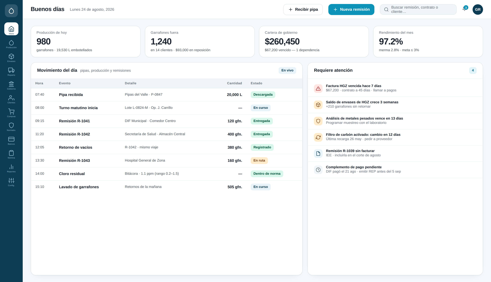
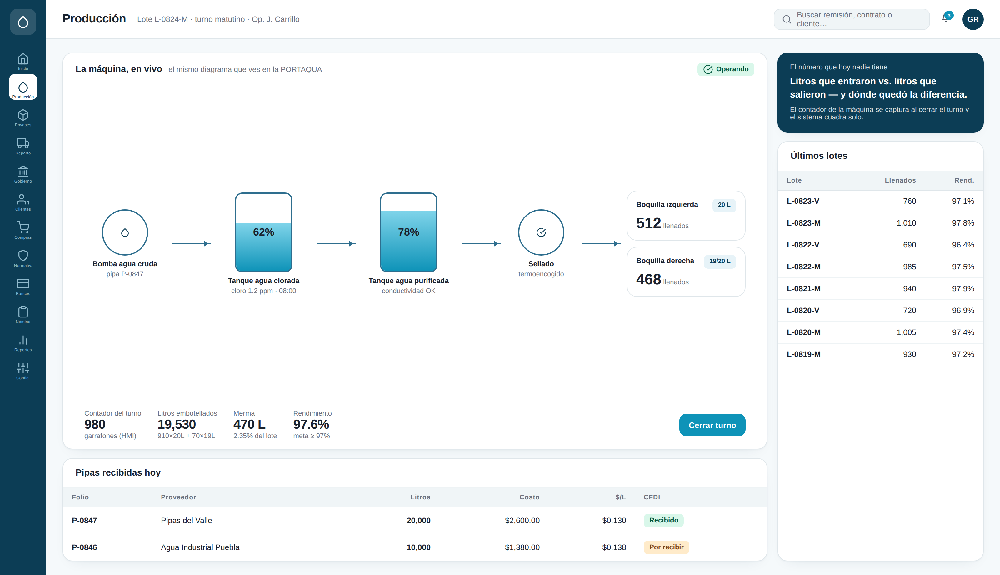
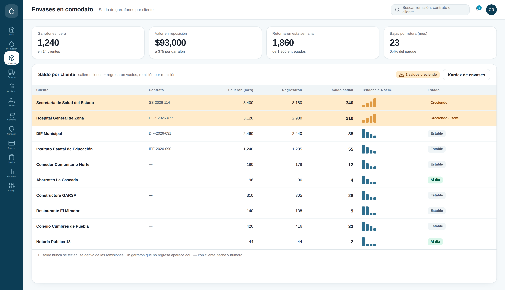
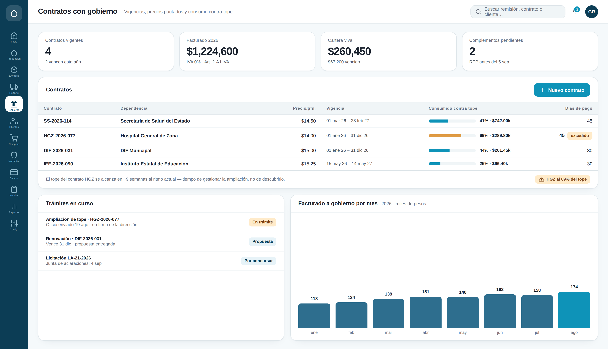
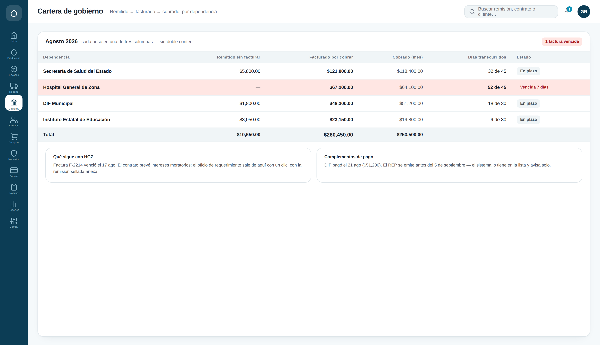
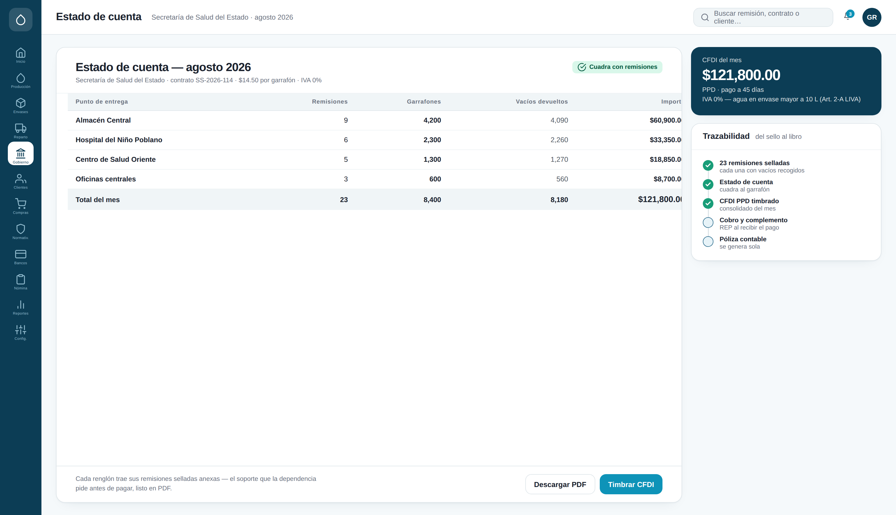
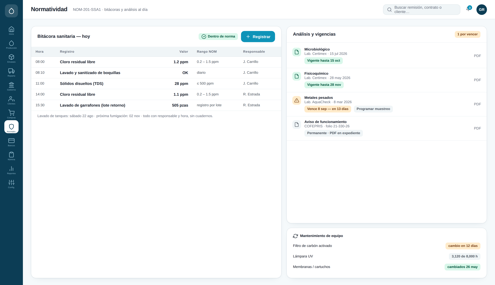

# Planta purificadora — Cada litro y cada garrafón, contados

Propuesta de sistema integral para la planta purificadora (mismo dueño que el
proyecto Haltus Hope). Compra pipas de agua cruda, purifica con una máquina
PORTAQUA BPS3, llena garrafones de 20 L y 19 L, y entrega por camión a
dependencias de gobierno, recogiendo los vacíos.

**[⬇ Descargar el deck (PowerPoint, 15 láminas)](planta-agua.pptx)**  ·  [Arquitectura técnica](arquitectura.md)

---

## La idea

Dos ciclos cerrados, ambos contados:

```
EL CICLO DEL AGUA      pipa (litros) → producción → remisión → factura → banco
EL CICLO DEL ENVASE    sale lleno → regresa vacío → se lava → se llena → saldo por cliente
```

Litros comprados vs. litros embotellados = rendimiento. Salieron − regresaron =
saldo de envases por dependencia. Si un número no cuadra, el sistema lo dice.

## Las pantallas

### Tablero del dueño
**Resuelve:** enterarse de lo que pasa sin estar en la planta.



### Producción — la misma máquina, ahora con memoria
**Resuelve:** saber cuánta agua entró, cuánta salió y dónde quedó la diferencia.

La pantalla espeja el diagrama de la PORTAQUA. El contador del turno se captura
al cierre y el sistema cuadra litros comprados contra embotellados.



### Envases en comodato
**Resuelve:** el activo del negocio circulando sin saldo por cliente.



### Contratos con gobierno
**Resuelve:** vender contra un tope que nadie está midiendo.



### Cartera de gobierno
**Resuelve:** cobranza a 30–45 días administrada de memoria.



### Estado de cuenta y CFDI
**Resuelve:** armar la factura del mes buscando talones.



### Normatividad
**Resuelve:** bitácoras en cuadernos y análisis vencidos sin aviso.



### La remisión, desde el camión
**Resuelve:** el talón sellado que vive en una carpeta.


---

## Un caso recorre todas las pantallas

Lunes 24 de agosto: llega una pipa de 20,000 L → la máquina llena 980 garrafones
(910×20L + 70×19L, rendimiento 97.6%) → la remisión R-1042 entrega 400 llenos a
la Secretaría de Salud y recoge 380 vacíos (saldo +340, alerta) → la bitácora
registra cloro 1.1 ppm → fin de mes: estado de cuenta de $121,800 cuadrado con
23 remisiones → CFDI PPD con IVA 0% → cobro a 45 días y complemento de pago.

Los números cuadran entre pantallas a propósito: esa continuidad es el producto.

## Sobre estas pantallas

Se generan con HTML y se capturan con un navegador sin interfaz: corregir un
dato, un precio o la marca es volver a correr el generador. La marca de la
planta del cliente sustituye a la genérica cuando esté definida.

Los datos son ficticios; las dependencias son nombres genéricos.
